# ML Crash Course: House Rent Prediction - Project Architecture

## 🎯 **What This Project Does (Simple Explanation)**

This project is like a **smart house rent calculator** that:
1. **Learns** from thousands of house listings
2. **Predicts** rent for new houses
3. **Works automatically** without human intervention
4. **Can be used by anyone** through a simple website

Think of it as a **real estate expert** that never sleeps and can instantly tell you what a house should rent for!

## 🔄 **Simple Technical Workflow (Step-by-Step)**

Here's exactly how the entire system works, explained for full-stack engineers:

### **Phase 1: Data Setup & Storage**
```
1. CSV Dataset (House_Rent_Dataset.csv) 
   ↓
2. upload_data_to_s3.py script uploads to MinIO (local S3)
   ↓
3. Data stored in MinIO bucket: s3a://ml-crash-course-data/House_Rent_Dataset.csv
```

### **Phase 2: ML Model Training**
```
4. Spark job (preprocess_and_train.py) reads CSV from MinIO
   ↓
5. Feature Engineering:
   - Convert text fields (City, Area Locality) to numbers using StringIndexer
   - Combine all features into a single vector using VectorAssembler
   ↓
6. Train RandomForest model on 80% of data
   ↓
7. Save trained model to MinIO: s3a://ml-crash-course-data/model
   ↓
8. Evaluate model on 20% test data (RMSE: ~44,905, R²: ~0.466)
```

### **Phase 3: Model Serving**
```
9. Flask API (model_api/app.py) starts up
   ↓
10. API loads the trained model from MinIO on first request
    ↓
11. Client sends POST request with house data (BHK, Size, City, etc.)
    ↓
12. API converts request to Spark DataFrame
    ↓
13. Model makes prediction and returns JSON response
```

### **Phase 4: Orchestration (Optional)**
```
14. Airflow DAG (ml_pipeline.py) can trigger the Spark job
    ↓
15. DAG monitors job execution and logs results
```

## 🏗️ **System Overview**

This project implements a complete Machine Learning pipeline for house rent prediction using modern cloud-native technologies. The system follows a microservices architecture with containerized components and supports both local development and cloud deployment.

## 📊 **Architecture Flowchart**

```mermaid
graph TB
    %% Data Sources
    A[📊 House Rent Dataset<br/>CSV File] --> B[📤 Data Upload Script<br/>upload_data_to_s3.py]
    
    %% Storage Layer
    B --> C[🗄️ MinIO/S3 Storage<br/>Object Storage]
    
    %% Processing Layer
    C --> D[⚡ Apache Spark<br/>Data Processing & Training]
    D --> E[🤖 ML Model<br/>Random Forest Regression]
    E --> C
    
    %% Orchestration Layer
    F[🔄 Apache Airflow<br/>Workflow Orchestration] --> D
    
    %% API Layer
    C --> G[🌐 Flask API<br/>Model Serving]
    G --> H[📱 Client Applications<br/>REST API Calls]
    
    %% Infrastructure Layer
    I[🐳 Docker Compose<br/>Local Development] --> J[☁️ AWS Infrastructure<br/>Production Deployment]
    J --> K[🚢 Kubernetes<br/>Container Orchestration]
    K --> L[📦 ECR<br/>Container Registry]
    
    %% Monitoring & UI
    M[📊 Spark UI<br/>Job Monitoring] --> D
    N[🖥️ Airflow UI<br/>DAG Management] --> F
    
    %% Styling
    classDef dataSource fill:#e1f5fe
    classDef storage fill:#f3e5f5
    classDef processing fill:#e8f5e8
    classDef api fill:#fff3e0
    classDef infra fill:#fce4ec
    
    class A,B dataSource
    class C storage
    class D,E,F processing
    class G,H api
    class I,J,K,L infra
    class M,N api
```



## 🛠️ **Technology Stack**

### **Data Layer**
- **MinIO**: S3-compatible object storage for local development
- **AWS S3**: Cloud object storage for production
- **CSV Dataset**: House rent data with features like BHK, Size, City, etc.

### **Processing Layer**
- **Apache Spark**: Distributed data processing and ML training
- **PySpark ML**: Machine learning library for Spark
- **Random Forest Regression**: ML algorithm for rent prediction
- **Feature Engineering**: Categorical encoding, vector assembly

### **Orchestration Layer**
- **Apache Airflow**: Workflow orchestration and scheduling
- **DAGs**: Directed Acyclic Graphs for pipeline management
- **Bash Operators**: Task execution and coordination

### **API Layer**
- **Flask**: Lightweight web framework for model serving
- **REST API**: HTTP endpoints for predictions
- **JSON**: Data exchange format

### **Infrastructure Layer**
- **Docker**: Containerization for consistent environments
- **Docker Compose**: Multi-container orchestration for local development
- **Kubernetes**: Container orchestration for production
- **AWS EKS**: Managed Kubernetes service
- **AWS ECR**: Container registry
- **Terraform**: Infrastructure as Code (IaC)

### **Development Tools**
- **Python 3.8+**: Primary programming language
- **Jupyter Notebooks**: Data exploration and experimentation
- **Git**: Version control
- **CI/CD**: GitHub Actions for automated deployment

## 🔄 **Data Flow**

### 1. **Data Ingestion**
```
CSV Dataset → upload_data_to_s3.py → MinIO/S3 Storage
```

### 2. **Data Processing & Training**
```
S3 Data → Spark Job → Feature Engineering → Model Training → Save Model to S3
```

### 3. **Model Serving**
```
S3 Model → Flask API → REST Endpoints → Client Applications
```

### 4. **Orchestration**
```
Airflow DAG → Trigger Spark Job → Monitor Execution → Log Results
```

## 🏃‍♂️ **Execution Modes**

### **Local Development**
```bash
# Start all services
docker compose up -d

# Access services
MinIO: http://localhost:9000
Airflow: http://localhost:8081
Spark UI: http://localhost:8080
Model API: http://localhost:5001
```

### **Production Deployment**
```bash
# Infrastructure setup
terraform apply

# Deploy to Kubernetes
kubectl apply -f k8s/

# Access production services
Model API: https://your-domain.com
```

## 📁 **Project Structure**

```
RentPredictor/
├── 📊 data/                          # Dataset and documentation
├── 🐳 docker-compose.yml             # Local development setup
├── ⚡ spark_jobs/                    # ML training pipeline
├── 🌐 model_api/                     # REST API service
├── 🔄 dags/                          # Airflow workflows
├── ☁️ infra/                         # Terraform infrastructure
├── 🚢 k8s/                           # Kubernetes manifests
├── 🔧 .github/workflows/             # CI/CD pipelines
├── 📝 PROJECT_ARCHITECTURE.md        # Detailed architecture docs
├── 📖 BLOG_POST.md                   # Learning journey blog
└── 🎯 README.md                      # Project documentation
```

## 🔧 **Key Components**

### **1. Data Pipeline (`spark_jobs/preprocess_and_train.py`)**
- Reads CSV data from S3/MinIO
- Performs feature engineering (categorical encoding)
- Trains Random Forest Regression model
- Saves trained model to S3
- Evaluates model performance

### **2. Workflow Orchestration (`dags/ml_pipeline.py`)**
- Defines Airflow DAG for ML pipeline
- Triggers Spark job execution
- Handles task dependencies and scheduling

### **3. Model API (`model_api/app.py`)**
- Flask REST API for model serving
- Loads trained model from S3
- Provides prediction endpoints
- Handles JSON request/response

### **4. Infrastructure (`infra/main.tf`)**
- AWS S3 bucket for data storage
- ECR repository for container images
- EKS cluster for Kubernetes deployment

## 🚀 **CI/CD Pipeline Features**

### **Automated Workflows:**
- **Infrastructure as Code:** Terraform-managed AWS resources
- **Container Orchestration:** EKS deployment with auto-scaling
- **Image Management:** Automated ECR builds and pushes
- **Data Pipeline:** Automated dataset uploads and processing
- **Monitoring:** Comprehensive logging and observability

### **Cost Optimization:**
- **Scheduled Cleanup:** Automatic resource cleanup to minimize costs
- **Resource Scaling:** Auto-scaling based on demand
- **Spot Instances:** Cost-effective compute resources

## 🎯 **Use Cases**

1. **Real-time Rent Prediction**: API endpoints for instant predictions
2. **Batch Processing**: Scheduled model retraining with new data
3. **Data Pipeline**: Automated data processing and feature engineering
4. **Model Monitoring**: Track model performance and drift
5. **Scalable Deployment**: Cloud-native architecture for production workloads

## 🚀 **Benefits**

- **Scalability**: Distributed processing with Spark
- **Reliability**: Containerized services with health checks
- **Flexibility**: Support for both local and cloud deployment
- **Maintainability**: Infrastructure as Code with Terraform
- **Observability**: Built-in monitoring and logging
- **Reproducibility**: Consistent environments with Docker

## 📊 **Service Access URLs**

| Service | URL | Purpose |
|---------|-----|---------|
| **MinIO Console** | http://localhost:9001 | S3-compatible storage management |
| **Spark UI** | http://localhost:8080 | Monitor Spark jobs |
| **Airflow UI** | http://localhost:8081 | Workflow orchestration |
| **Model API** | http://localhost:5001 | REST API for predictions |

### **Default Credentials**

| Service | Username | Password |
|---------|----------|----------|
| **MinIO** | `minioadmin` | `minioadmin` |
| **Airflow** | `admin` | `admin` |

## 🔧 **Development & Deployment Options**

### **Local Development:**
- Use `docker-compose.yml` for quick local setup
- Perfect for development and testing
- All services run in containers

### **Cloud Deployment:**
- Use GitHub Actions for automated deployment
- Production-ready with auto-scaling
- Managed AWS services for reliability

### **Hybrid Approach:**
- Develop locally, deploy to cloud
- Use same codebase for both environments
- Consistent behavior across environments

This architecture demonstrates modern ML engineering practices with cloud-native technologies, making it suitable for both learning and production use cases. 